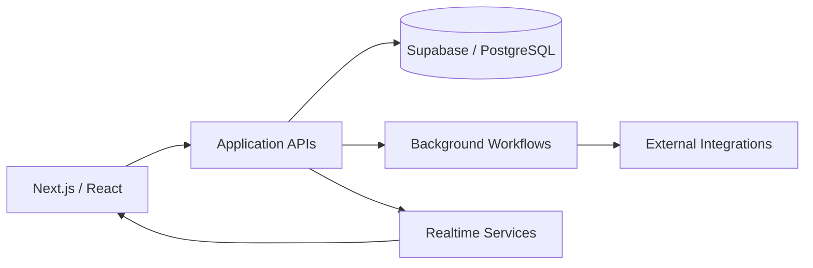

# AngkorAds

### Marketplace / Social Commerce — Architecture Case Study

AngkorAds is an all-in-one marketplace built from scratch for the Cambodian market. It combines product listings, advanced search, image-based product discovery, social features, advertising, boosting, bidding and real-time interactions.

The production application is private. This repository documents the architecture and engineering decisions without exposing proprietary source code.

## Product Scope

- Product listings and discovery
- Advanced text and image-based search
- Seller advertising and listing boosts
- Normal and live bidding flows
- Social interactions and real-time communication
- Background processing for work that should not block user requests
- Payment integrations

## Architecture

## Core Stack

**Frontend:** Next.js, React, TypeScript, Tailwind CSS  
**State:** TanStack React Query, Zustand  
**Backend:** Node.js, REST APIs  
**Data:** Supabase, PostgreSQL  
**Async processing:** Inngest  
**Realtime:** WebSockets / Supabase Realtime  
**Deployment:** Vercel  
**Payments:** Stripe and local payment flows  
**Media:** Image-processing workflows

## Engineering Challenges

### Background processing

Some operations are too expensive or slow to keep inside a normal request/response cycle. Those operations are moved into background workflows so the API can return without waiting for the complete processing lifecycle.

### Realtime interactions

Chat and live marketplace activity require state changes to reach connected clients quickly. Realtime communication is used where polling would add unnecessary latency and load.

### State separation

Server state and local UI state have different lifecycles. TanStack React Query handles server-backed state and caching, while Zustand handles focused client-side state.

### Search and image discovery

Product discovery combines structured product data with image-processing workflows to support discovery beyond simple keyword matching.

## Selected Engineering Decisions

**Async work:** Use background workflows for long-running operations.  
**Trade-off:** Adds job lifecycle, retry and eventual-consistency concerns.

**Realtime:** Use realtime channels for interactions where immediate updates matter.  
**Trade-off:** Requires careful connection, authorization and state-reconciliation handling.

**State management:** Separate server state from local UI state.  
**Trade-off:** Requires clear boundaries between query/mutation state and local interaction state.

## Private Production Code

The production repository contains proprietary business logic and infrastructure. This public case study intentionally focuses on architecture, engineering decisions and system boundaries.

